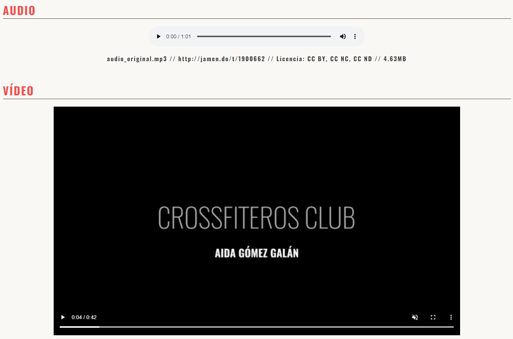

:es: Práctica para la manipulación de diferentes tipos de archivos media y su inclusión en una página web.

:gb: Practice for manipulating different types of media files and including them in a web page.
